# Yksilötehtävät

Tämä tiedosto sisältää dokumentaation Projekti: Terveyssovelluksen kehitys- kurssille (TX00EY13-3002)

## Sisältö (tehtävät)

- Tehtävä 1
- Tehtävä 2
- Tehtävä 3
- Tehtävä 4
- Tehtävä 5
- Tehtävä 6
- Tehtävä 7
- Tehtävä 8
- Tehtävä 9

Tehtävä 10 on tämä dokumentaatiotiedosto tehtävistä 1- 9.

## 1. Tehtävä 1, Työkalujen Asennus

Tehtävänanto: 

"Asenna omalle koneellesi seuraavat työkalut: Robot Framework, Browser Library, Requests library, CryptoLibrary, Robotidy
Dokumentoi asennus. Ks. Tehtävien palautus ja Tehtävä 10."

#### 1. Uusi kansio nimeltään "sovellustesti", jonka alle kopioitu period 3 aikana tehdyt Frontend ja Backend- kansiot, jotka uudelleenlinkitetty uuteen github repositioon (ja irrotettu vanhoista).

Projektirakenne:
```
sovellustesti
   > frontend/
   > backend/
   > tests/
   > resources/   
   > outputs/   
``` 
#### 2. Python versio, luotiin, sekä aktivoitiin virtuaaliympäristö. Komennot suoritettiin bash- terminaalissa. Komennot ja tulokset näkyvät alla olevassa kuvassa (Kuva 1).

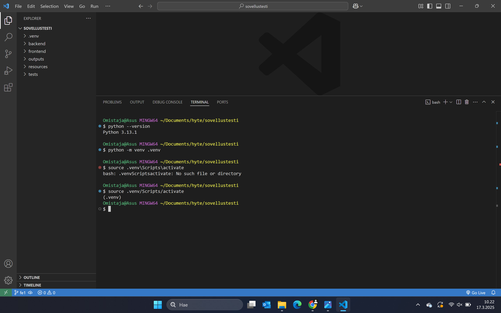
Kuva 1. Python asennuksen tarkistus, virtuaaliympäristön luominen ja aktivointi bash- terminaalissa.

Python versio tarkistettiin komennolla:  `python --version`. Terminaalin kirjoitettiin sitten `python -m venv .venv`, jolla virtuaaliympäristö luotiin. Komento `source .venv/Scripts/activate` aktivoi virtuaaliympäristön, jossa suoritetaan loput asennukset. 

Projektin juuressa luotiin `.gitignore`- tiedosto, johon lisättiin `.venv`.

#### 3. Pip- päivitys viimeisimpään versioon (Kuva 2).

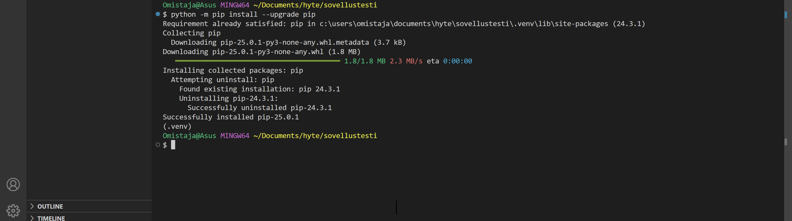
Kuva 2. Pip- päivitys bash- terminaalissa.

Päivitys suoritettiin komennolla `python -m pip install --upgrade pip`. Tuloksena oli viesti: "Succesfully installed pip-25.0.1". Pip päivitys oli onnistunut.

#### 4. Robot Framework asennus (Kuva 3).

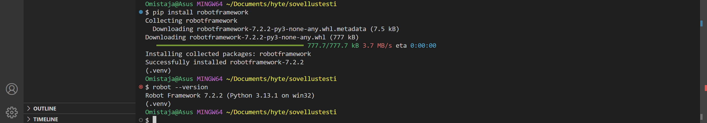
Kuva 3. Robot Framework asennus ja testaus.

Robot Framework asennettiin komennolla `pip install robotframework`. Asennus tarkistettiin komennolla `robot --version`.

#### 5. Browser Libraryn asennus.

Ensimmäisen tarkistettiin Pythonin että Node.JS asennukset, jonka jälkeen suoritettiin Browser Libraryn asennus (kuva 4).

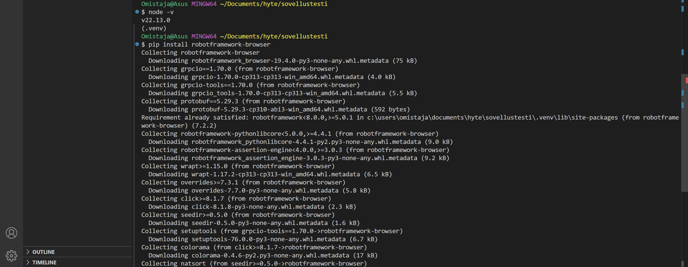
Kuva 4. Python ja Node.js asetusten tarkistus ja Browser Libraryn asennus.

Asetukset tarkistettiin komennolla `node -v`. Browser Library asennettiin komennolla `pip install robotframework-browser`.

Asennuksen jälkeen suoritettiin kirjaston alustus (Kuva 5).

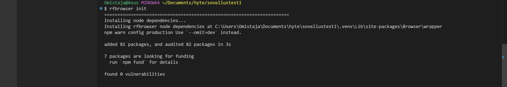
Kuva 5. Browser Library kirjaston alustus.

Alustus suoritettiin komennolla `rfbrowser init`.

#### 6. Requests Libraryn asennus. (kuva 6)

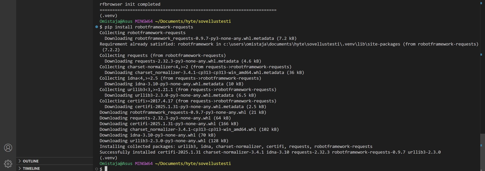
Kuva 6. Requests Library kirjaston asennus.

Request Libraryn asennus suoritettiin komennolla `pip install robotframework-requests`.

#### 7. Cryptolibraryn asennus. (kuva 7)

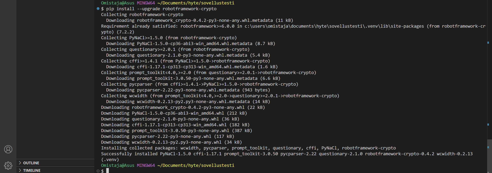
Kuva 7. Cryptolibrary kirjaston asennus.

Cryptolibraryn asennus suoritettiin komennolla `pip install --upgrade robotframework-crypto`.

#### 8. Robotidyn asennus. (kuva 8)

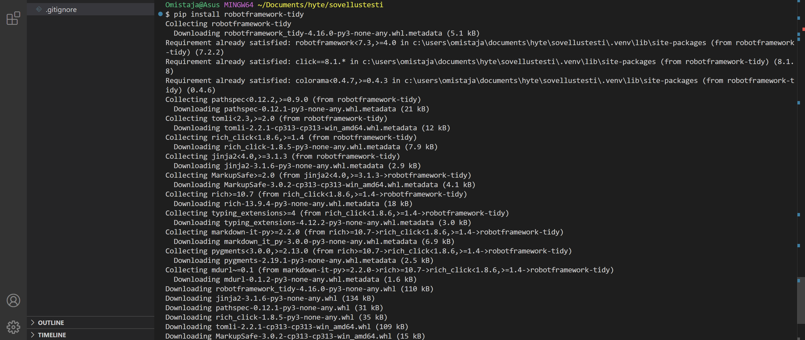
Kuva 8. Robotidyn asennus.

Robotidyn asennus suoritettiin komennolla `pip install robotframework-tidy`.

#### 9. Asennuslistan tarkistus. (kuva 9)

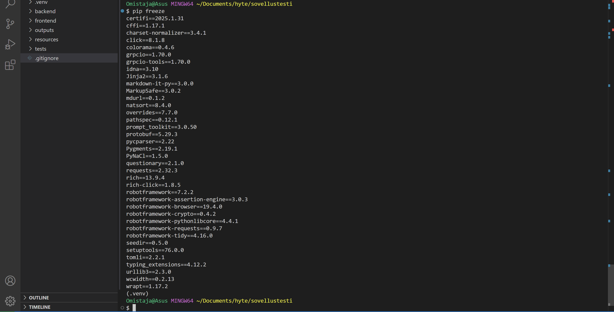
Kuva 9. Asennuslistan tarkistus.

Python-ympäristöön asennetut paketit ja niiden versiot listattiin kommenolla `pip freeze`.

#### 10. requirements.txt-asennuslista. (Kuva 10)

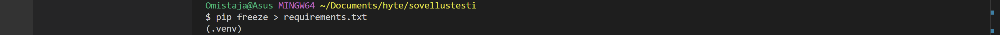
Kuva 10. Asennuslistan luominen.

Asennuslista tulevaisuutta varten luotiin komennolla `pip freeze > requirements.txt`.

#### 11. Asennusten testaus. (Kuva 11)

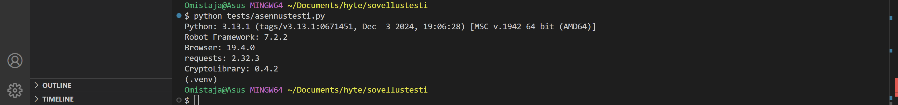
Kuva 11. Asennuslistan testaaminen.

Asennusten toimivuus testattu komennolla `python tests/asennustesti.py`.

## 2. Tehtävä 2, kirjautumistesti omalle terveyspäiväkirja-sovellukselle. (Kuva 12)

Tehtävänanto: "Sovella esimerkkiä ja tee kirjautumistesti omalle terveyspäiväkirja-sovelluksellesi. 
Katso tarkemmat ohjeet: [linkki](https://github.com/sakluk/projekti-terveyssovelluksen-kehitys/blob/main/ohjeet_testaus/02_gui_testaus.md)"

Ensimmäisenä kopioitiin opettajan antamat esimerkkitiedostot tests- kansioon, jonka jälkeen tehtiin demotestejä. Sitten luotiin uudet tiedostot muuttujille, sekä varsinaiselle testille. 

Oma testi luotiin opetusmateriaalien pohjalta omaa päiväkirjasovellusta vastaavaksi.

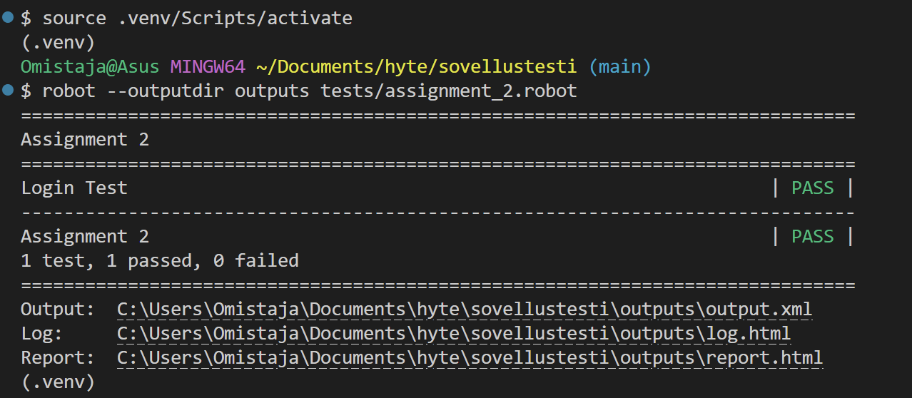
Kuva 12. Koodi sisäänkirjautumis- testin suorittamiseen ja suorituksen onnistuminen.

`robot --outputdir outputs tests/assignment_2.robot`- komennolla testi käynnistettiin ja tulostukset ohjattiin outputs-kansioon.

Huom! Muuttujat sisältävää tiedostoa ei syötetty tietoturvasyistä Githubiin.

## 3. Tehtävä 3, jatkotestejä Web form- esimerkkisivulle. (Kuva 13)

Tehtävänanto: "Tutki lisää Browser Libraryn käyttöä. Tee testi, joka testaa Web form-esimerkkisivun muiden 
kenttien toimintaa (Dropdown (select), Dropwdown (datalist), File input, Checkboxit, Radio 
buttonit, jne)."

Testejä tehty:
- Text input, käyttäjänimen syöttö
- Type secret, salasanan syöttö
- Type Text, Message syötetty
- Dropdown menu (select), valittu tietty numero
- Dropdown menu (datalist), syötetty tietty kaupunki
- File Input, luotu projektiin tyhjä tiedosto, joka ladattiin.
- Checkboxit ja radiobuttonit, valittu tyhjät checkboxit, klikattu pois jo- valitut
- Example range, liikutettu napattu kiinni ja raahattu hiukan vasemmalle.

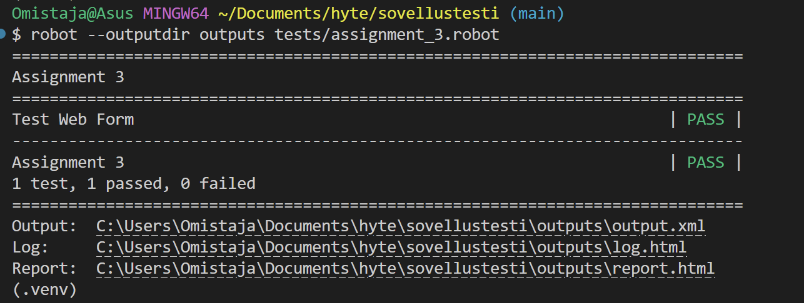
Kuva 13. Koodi web form esimerkkisivun testaamiseen ja suorituksen onnistuminen.

`robot --outputdir outputs tests/assignment_3.robot`- komennolla testi käynnistettiin ja tulostukset ohjattiin outputs-kansioon.

Huom! Muuttujat sisältävää tiedostoa ei syötetty tietoturvasyistä Githubiin.

## 4. Tehtävä 4, uusi päiväkirjamerkintätesti omalle terveyspäiväkirja-sovellukselle. (Kuva 14)

Ensin testissä suoritetaan tehtävän 2 mukainen sisäänkirjautuminen. Seuraavaksi siirrytään etusivulta HRV-mittaukset- sivulle, jossa syötetään päiväkirja- formiin uudet mittaustiedot (muuttujat tulevat erillisesti tiedostosta). Tämä form syötetään sovelluksen tietokantaan ja sivu ladataan uudelleen. (Sivun uudelleen lataus hakee päiväkirjamerkinnät uudestaan tietokannasta ja listaa nyt myös uuden merkinnän.)

Mittaustuloksia tarkastellaan painamalla "MITTAUS 1"- nappia (listalla aina uusin). Tämä avaa modaalin, jossa näkyy käyttäjän syöttämä mittausdata. "Sulje"- napista modaali sulkeutuu.

Testi päättyy uloskirjautumiseen, jossa painetaan "Kirjaudu ulos"- nappia navigaatiossa.

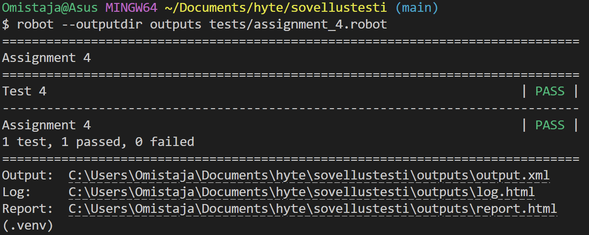
Kuva 14. Koodi uuden päiväkirjamerkinnän syötön testaamiseen ja suorituksen onnistuminen.

`robot --outputdir outputs tests/assignment_4.robot`- komennolla testi käynnistettiin ja tulostukset ohjattiin outputs-kansioon.

Huom! Muuttujat sisältävää tiedostoa ei syötetty tietoturvasyistä Githubiin.

## 5. Tehtävä 5, kirjautumistesti omalle terveyspäiväkirja-sovellukselle käyttäen .env- tiedostoa.

Tehtävänanto: "Tee kirjautumistesti omalle sovelluksellesi, joka käyttää ’.env’-tiedostoon piilotettuja 
käyttäjätunnusta ja salasanaa."

Ensin asennettiin pythonin dotenv-kirjasto, jotta .env- tiedostoja voidaan lukea ja soveltaa. Tämä tehtiin komennolla `pip install python-dotenv` (Kuva 15), kun virtuaaliympästö oli laitettu päälle.

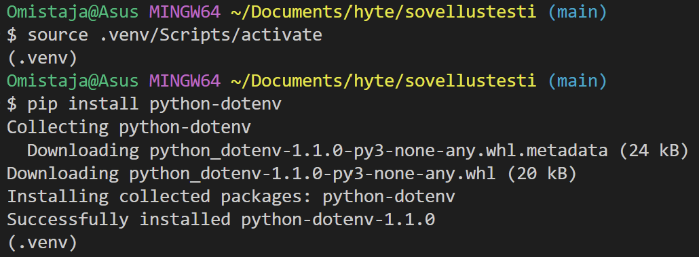
Kuva 15. Komento python-dotenv-kirjaston asennuksesta, sekä suoriutumisen onnistuminen.

Opettajien tukimateriaalia hyödyntäen, .env- tiedostoon syötettiin käyttäjänimi ja salasana. Seuraavaksi luotiin python kirjasto, jossa määriteltiin testiä varten muuttujat Robot Frameworkille.

Tätä kirjastoa hyödyntäen suoritettiin uusi kirjautumistesti (Kuva 16).

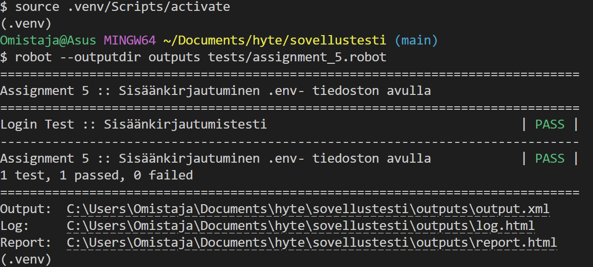
Kuva 16. Koodi sisäänkirjautumisen suorittamisesta, sekä suoriutumisen onnistuminen.

`robot --outputdir outputs tests/assignment_5.robot`- komennolla testi käynnistettiin ja tulostukset ohjattiin outputs-kansioon.

Huom! Muuttujat sisältävää tiedostoa ei syötetty tietoturvasyistä Githubiin. __pycache__- repositio myös jätetty pois.

## 6. Tehtävä 6, kirjautumistesti omalle terveyspäiväkirja-sovellukselle käyttäen CryptoLibrary (Kuva 17).

Ensin käynnistettiin CryptoLibraryn käyttö komennolla `python -m CryptoLibrary`.

Valikosta valittiin nuolinäppäimillä `Open config` -> `Configure key pair` -> `Generate key pair`, jolla saatiin kaksi avainta ja salasana.

Tietojen salausta varten suoritettiin komento `python -m CryptoClient`. Valikosta valittiin nuolinäppäimillä `Encrypt` -> `Enter the password to encrypt`, johon kirjoitettiin salatut tiedot yksi kerrallaan. Tulostetut tiedot kopioitiin koodiin.

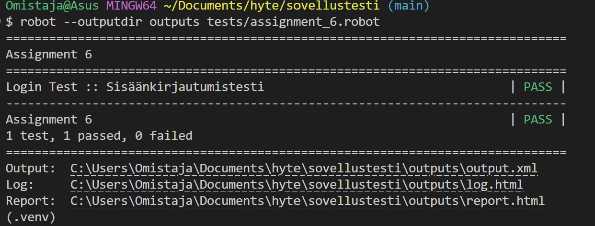
Kuva 17. Koodi sisäänkirjautumisen suorittamisesta, sekä suoriutumisen onnistuminen.

`robot --outputdir outputs tests/assignment_6.robot`- komennolla testi käynnistettiin ja tulostukset ohjattiin outputs-kansioon.

## 7. Tehtävä 7, tulostus outputs kansioon.

Tehtävänanto: "Ohjaa testien loki- ja raporttitiedostot erilliseen outputs/-kansioon."

Kaikissa tehtävissä testien loki- ja raporttitiedostot on tulostettu erilliseen outputs/-kansioon komennolla `robot --outputdir outputs tests/<tehtävänkansio>.robot`

Esimerkkejä näkyy tehtävien 2-6 ja 9 kuvissa.

## 8. Tehtävä 8, github.io-sivusto.

Luotu ensin Github- sivu, nimeltää Nappulat.github.io. Omaa projektia muokattu siten, että jokaiseen kansioon tehty readme.md- tiedostot, jossa linkit kansioiden tiedostoihin.

HUOM! Nämä muokkaukset on tehty alkuperäiseen projektirepoon (tämä kyseinen repositio on vain kopio), koska alihakemistot aiheuttivat ongelmia tällä projektilla. Testit ajettiin virallisessa projektissa uudestaan.

[Linkki viralliseen projektirepoon](https://github.com/Nappulat/fe-projekti)

Virallisessa repositiossa siirryttiin asetuksiin --> Pages ja julkaistiin main- branch.

[Linkki raportteihin ja lokeihin](https://nappulat.github.io/fe-projekti/)

## 9. Tehtävä 9, taustapalvelimen testaus (Päivitetty) (kuva 18).

Tehtävänanto: "Tee testit, joilla testaat oman taustapalvelimen toimintaa."

Taustapalvelinta käsketty suorittamaan 2 testiä:
- Luo uusi (dummy) käyttäjä sovellukseen
- Kirjaudu tunnuksilla sisään

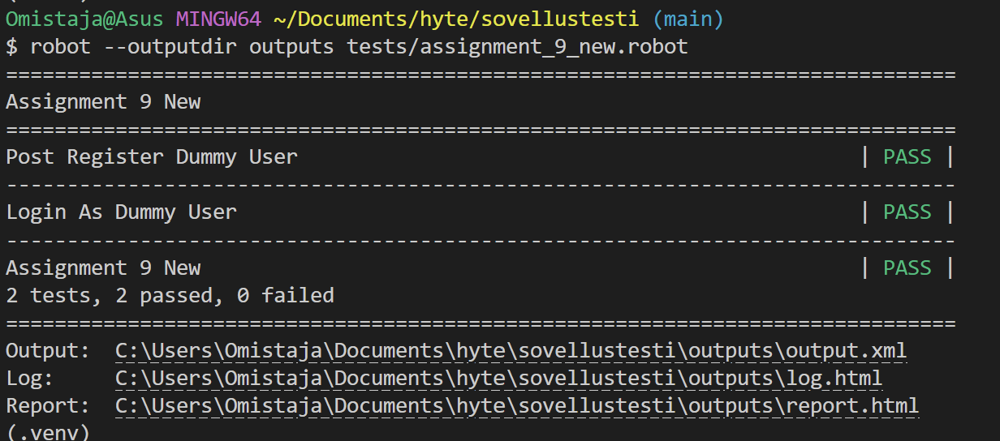
Kuva 18. Koodi taustapalvelimen testauksen suorittamisesta, sekä suoriutumisen onnistuminen.

`robot --outputdir outputs tests/assignment_9_new.robot`- komennolla testi käynnistettiin ja tulostukset ohjattiin outputs-kansioon.

## Github.io yhteenveto kaikista ohjelmistotesteistä

`robot --outputdir outputs tests/assignment_2.robot tests/assignment_3.robot tests/assignment_4.robot tests/assignment_5.robot tests/assignment_6.robot tests/assignment_9_new.robot`- komennolla ajettiin kaikki testit uudestaan, jotta ne saatiin github.io sivulle ---> [Linkki raportteihin ja lokeihin](https://nappulat.github.io/fe-projekti/)

[Linkki projektirepon README.md](https://github.com/Nappulat/fe-projekti/blob/main/README.md)